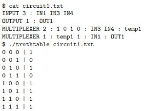

# Circuit Simulator

In this project, any circuit consisting of basic logic gates (AND, OR, NOR, NAND, NOR, XOR), Decoders, 
and/or Multiplexers can be simulated. The program takes as argument a file in which each line specifies a 
logic gate or building block followed by its input(s) and output(s). Each file must begin with 2 lines: 

INPUT  (number of inputs)  (input1 input2 ... inputN)
OUTPUT (number of outputs) (output1 output2 ... outputN)

After this any gate can be represented using the following format.

The program then tests the circuit using each possible combination of inputs and prints out its truth table.
Here is an example circuit.

To run the program

	1) download the files (the test_cases folder is option)
	2) Compile and build the program using the provided Makefile
	3) Run the program and pass as argument a text file containing the circuit description

	Example:
		./truthtable circuit_description.txt
		
	

