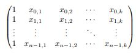
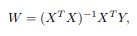
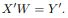

# Simple Machine-Learning

The goal of this program was to write a program that implements a simple machine-learning algorithm. 
Machine learning (ML) techniques are increasingly used to provide services, such as face recognition 
in photographs, spelling correction, automated translation, and predicting what YouTube videos you might 
want to watch next. In this program we implemented a “one shot” learning algorithm that uses historical 
data to predict house prices based on particular attributes.

For example, a house might have x1 bedrooms, x2 bathrooms, x3 square footage, and be built in
year x4. If we had appropriate weights, we could estimate the price of the house y with the formula

	y = w0 + w1x1 + w2x2 + w3x3 + w4x4
	
The goal of one-shot learning is to find values for the weights wi using a large provided set
of training data. Once those weights have been found, they can be used to estimate prices for
additional houses. For example, if the training data includes n houses and has k attributes, 
this data can be represented as an n × (k + 1) matrix X, of the form

In order to do this, is to compute the weight matrix denoted W

Once W has been found, it can be used with a new set of house attributes X0
to estimate prices for those houses by computing 

To run the program

	1) Download the files (the test_cases folder is optional).
	2) Compile and build the program using the provided Makefile.
	3) Run the program and pass as arguments the text files containing the training and input data

	Example:
		./learn training.txt data.txt
		
	

